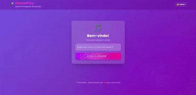
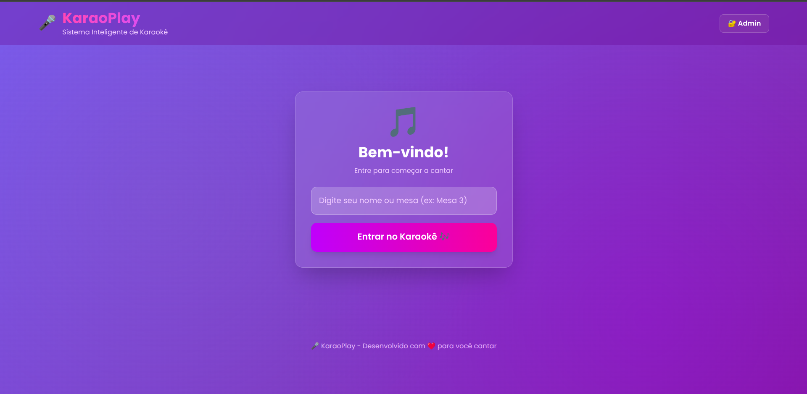
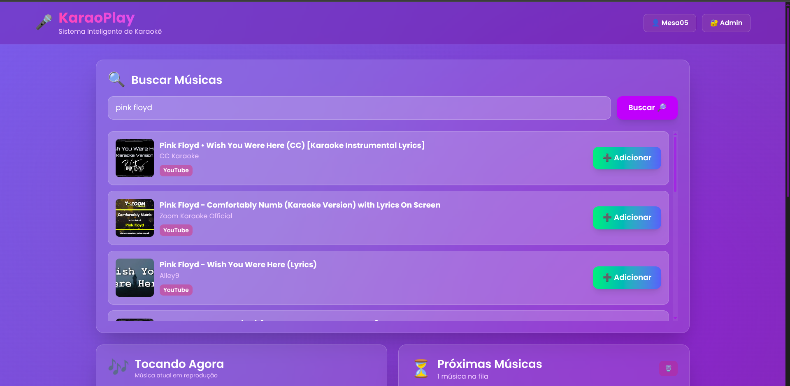
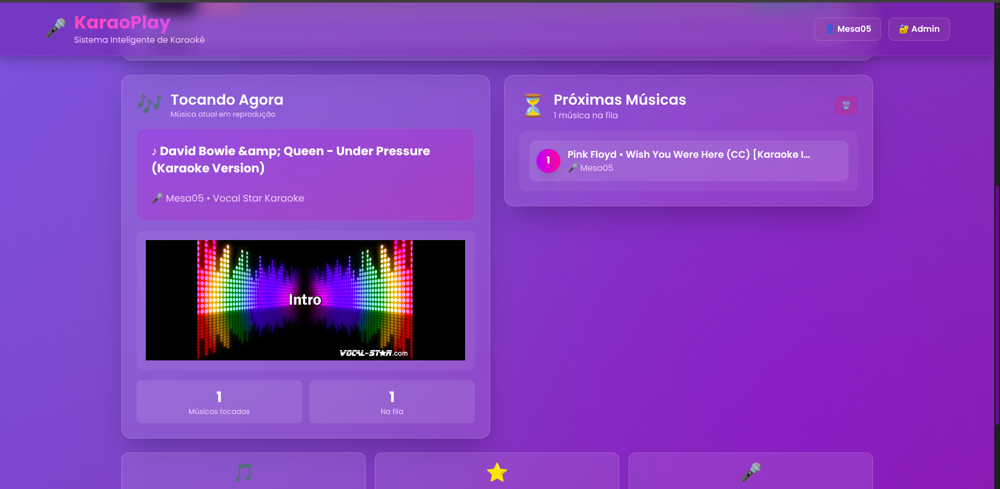
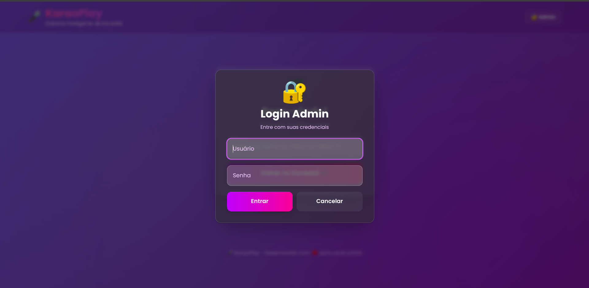
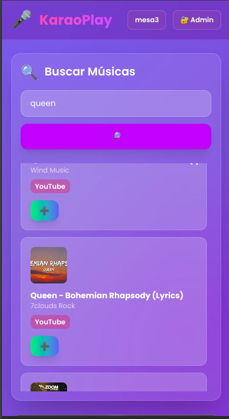

# 🎤 KaraoPlay — Sistema de Karaokê Web

## 🎬 Demo



---

**KaraoPlay** é uma aplicação web client-side para karaokê, desenvolvida com **HTML5, CSS3 e JavaScript moderno**, que permite busca de músicas no YouTube, gerenciamento de fila e controle de reprodução em tempo real, com foco em performance, UX e uso de APIs Web modernas.

---

## 📸 Screenshots

### Tela de Login


### Busca de Músicas


### Player e Fila


### Painel Admin


### Responsividade Mobile


---

## 🚀 Funcionalidades

- Sistema de login simples para identificação de usuários/mesas  
- Busca de músicas integrada ao **YouTube Data API v3**  
- Player de vídeo com **YouTube IFrame Player API**  
- Gerenciamento dinâmico de fila de músicas  
- Cache multinível (memória, sessionStorage e IndexedDB)  
- Retry automático com exponential backoff para falhas de API  
- Scroll preloading com **Intersection Observer**  
- Painel administrativo com autenticação persistente  
- Notificações visuais (toast) para feedback de ações  
- Layout totalmente responsivo (mobile-first)  

---

## 🛠️ Tecnologias Utilizadas

### Core
- **HTML5** — Semântica moderna  
- **CSS3** — Flexbox, Grid, animações e gradientes  
- **JavaScript (ES6+)** — async/await, arrow functions, módulos  

### Frameworks & Libraries
- **Tailwind CSS** (via CDN)  
- **Google Fonts** (Poppins)  

### APIs e Recursos Web
- **YouTube Data API v3**  
- **YouTube IFrame Player API**  
- **Fetch API**  
- **IndexedDB**  
- **localStorage / sessionStorage**  
- **Intersection Observer API**  

---

## 📦 Como Executar

### Pré-requisitos
- Navegador moderno  
- Chave da **YouTube Data API v3**

### Passos

#### 1️⃣ Clonar o repositório
```bash
git clone https://github.com/Tandson42/KaraoPlay.git
cd KaraoPlay
```

#### 2️⃣ Configurar a API Key
No arquivo `js/state.js`:

```javascript
const YOUTUBE_API_KEY = 'SUA_CHAVE_AQUI';
```

#### 3️⃣ Executar com servidor local (recomendado)
```bash
# Python
python3 -m http.server 8000

# Node.js
npx http-server -p 8000
```

Acesse:
```
http://localhost:8000
```

⚠️ **Para funcionamento completo do Fetch e IndexedDB, o uso de servidor HTTP é recomendado.**

---

## 🏗️ Arquitetura do Projeto

```
karaoplay/
├── index.html
├── style.css
└── js/
    ├── state.js    # Estado global, cache e utilitários
    ├── queue.js    # Gerenciamento da fila de músicas
    ├── youtube.js  # Integração com APIs do YouTube
    └── ui.js       # Eventos, interface e fluxo do usuário
```

### Destaques Técnicos
- Código modular com responsabilidades bem definidas
- Cache em múltiplas camadas para reduzir consumo de API
- Padrão stale-while-revalidate para melhor UX
- Tratamento de erros e feedback visual ao usuário

---

## 🚧 Limitações Conhecidas

- API Key do YouTube exposta no client-side (limitação natural de apps frontend)
- ARIA labels e navegação por teclado podem ser aprimorados
- IndexedDB pode crescer sem política agressiva de limpeza
- Tailwind via CDN (em produção, ideal usar build otimizado)

---

## 🤖 Uso de Inteligência Artificial

Este projeto contou com apoio parcial de ferramentas de IA (ex.: ChatGPT / Claude) para:

- Revisão e melhoria de código
- Sugestões de boas práticas
- Apoio na documentação

**Todas as decisões técnicas, arquitetura e validações finais foram realizadas pelo autor, que compreende integralmente o código e seu funcionamento.**

---

## 📄 Licença

Este projeto é distribuído para fins educacionais e demonstrativos.

---

## 📞 Autor

**Nome:** Tandson Filho  
**GitHub:** [@Tandson42](https://github.com/Tandson42)

---

<div align="center">

🎤 **KaraoPlay — Código, música e tecnologia em harmonia.**

⭐ *Se achou interessante, deixe uma estrela no repositório!*

</div>
